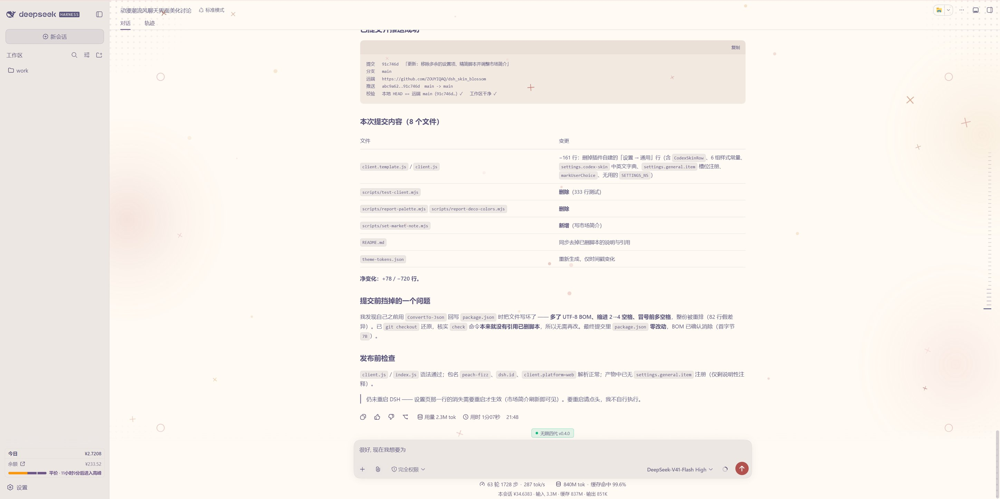
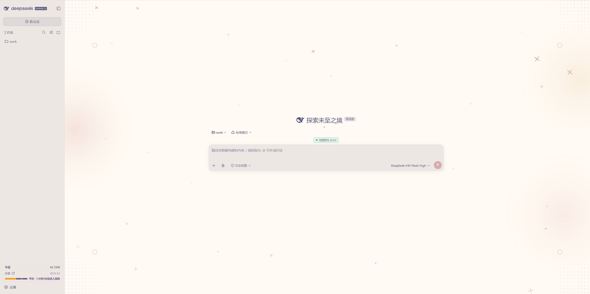

# 桃子气泡水 · Peach Fizz

为 **DeepSeek Harness (DSH) Web GUI** 做的第三方暖色皮肤：rose-pine Dawn 调的奶油底色，配上柔光、缓慢上浮的气泡与摇摆的固定星 —— 动漫、简洁、颜色干净。

<p align="center">
  
  <br>
  <sub>对话界面 —— 装饰层挂在对话栏内部，侧栏开合时随之被挤压</sub>
</p>

<p align="center">
  
  <br>
  <sub>空会话 —— 四角 halftone、三处暖色光斑、两侧粒子星</sub>
</p>

---

## 标识一览

| 项 | 值 | 说明 |
|---|---|---|
| 中文名 / 显示名 | **桃子气泡水** | `package.json` 的 `dsh.name`，DSH 插件列表里显示的就是它 |
| 英文名 | **Peach Fizz** | 仓库名与对外称呼沿用 |
| 主题名 | **桃子气泡水**（`THEME_LABEL`） | 主题面板里显示的标签 |
| 包名 / Loader 行 id / 客户端模块 id | `peach-fizz` | 必须是 ASCII 才能被 Loader 解析；三处保持一致 |
| 主题 id | `codex-theme-v1` | **刻意不动**：改了会让既有的主题配置失效 |
| 样式命名空间 | `--dsh-codex-*` / `.dsh-codex-*` | 内部命名，不动 |
| 装饰层 DOM id | `peach-fizz-style` / `-deco` / `-anchor` | 随包名走 |
| 用户选择记忆 | `sessionStorage: peach-fizz:user-choice` | 记下"用户已显式选过主题"，插件不再自动接管 |

> 历史沿革：`dsh-codex-skin` →（按仓库名）`dsh_skin_blossom` →（按品牌名）**`peach-fizz` / 桃子气泡水**。

## 它长什么样

| 部分 | 做法 |
|---|---|
| 配色基底 | rose-pine Dawn：奶油面 `#faf4ed`、面板 `#fffaf3`、正文 `#575279`、强调 `#d7827e` |
| 代码高亮 | rose-pine Dawn（`--shiki-*`），代码面 `#f2e9e1` |
| token 规模 | 浅色 195 项 / 深色 147 项（`--dsw-*` + `--shiki-*` + 自定义变量 + 色阶） |
| 对比度 | 浅色 23 项 + 深色 23 项全部通过（见 `theme-tokens.json`），另有 alias 全表比对，确保没有 token 掉回深色 |
| 装饰层 | 挂在对话栏内部的一层 `pointer-events:none` 装饰，`z-index` 在正文之下，侧栏开合时随对话栏一起被挤压 |

装饰元素（含历史上试过又撤掉的方案）：

| 元素 | 状态 | 参数 |
|---|---|---|
| **四角 halftone** `__wash` | 保留 | 380×380 方块、15px 间距、2px 点、`opacity .15`、`closest-side` 径向遮罩、四角各贴 −170px |
| **三处暖色光斑** `__panel` | 保留 | 三角形顶点：左中（玫瑰）/ 右上（暖金）/ 右下（暖珊瑚）；尺寸 `min(36vw,660px) × min(69vh,690px)`、浓度 14% / 14% / 12%、遮罩 `transparent 80%` |
| **气泡粒子** | 保留 | 逐颗 DOM 引擎：每颗抽定 x / 尺寸 4–10px（偶数）/ 浓度 0.10–0.30 / 颜色（4 个暖色）/ 上升 45–95s；**x 用两个均匀随机数求平均（三角分布）**，统计上中间多两边少；出生 2.5–5s 淡入；用 `animationend` 回收重生 |
| **固定星 × 5** `__star--t1…t5` | 保留 | 正文区那 5 颗；**三条独立动画**：摇摆（`rotate`，±38°–±60°）、缩放（`scale` 1→1.22）、明暗（`opacity` .42→.78），周期比 1 : 2.8 : 1.7 且相位错开 |
| **两侧粒子星** | 保留 | 每侧 6 颗；位置 / 大小 / 颜色 / 转速 / 方向 / 寿命逐颗随机，死后换位置重生；**互不重合**；带宽 17%，转 39–51 °/s |
| 满铺点阵 `__dots` 两档点 | **已撤** | 曾为 28px 瓦片 + 玫瑰/暖金两档点，撤除参数留档在 `scripts/build.mjs` 注释里 |
| 网格线 | **已撤** | 试过 48px/5% → 32px/5% → 24px/3% |

## 安装

插件通过 DSH 的 profile 机制加载。以 `desktop` profile 为例：

```bash
# 1) 把本仓库放到插件目录，例如
#    ~/.dsh/plugins/peach-fizz

# 2) 在该 profile 的 package.json 里加依赖
#    "peach-fizz": "file:/Users/<你>/.dsh/plugins/peach-fizz"

# 3) 让它进入 profile bundles
#    "bundles": [ ..., "peach-fizz" ]

# 4) 安装依赖（file: 依赖会被硬链接进 profile 的 node_modules）
pnpm install --prefer-offline
```

激活方式：

- **自动**：插件在**首次运行**时自动接管 —— 只在用户没有显式选过主题时生效；
- **手动**：在设置 →「外观」里选 **桃子气泡水**；切回内置主题也在同一处。

用户一旦显式选择过，插件就不再自动接管（选择记在 `sessionStorage: peach-fizz:user-choice`）。

> **改包名 / Loader 行 id 后必须重启一次 DSH 进程**：客户端产物按 rev 寻址、路径写死在启动时的 Loader 行上，改名会让 HMR 轮询的旧路径失效（表现为"改了但界面没反应"）。重启后路径正确，之后改 `client.js` 又会 500ms 内自动热更。

## 配置

- **配色 / 装饰样式**：全部由 `scripts/build.mjs` 生成，改调色板、光斑、固定星运动参数都改它，然后 `node scripts/build.mjs`。
- **气泡与粒子引擎**：参数在 `client.template.js` 顶部（`BUBBLE_*` / `STARS_PER_ZONE` / `STAR_*` 常量）。
- **构建产物**：`client.js` 是 DSH 实际加载的文件，由模板 + 生成器合成，**不要手改**。

主要旋钮：

| 常量 | 默认 | 含义 |
|---|---|---|
| `BUBBLE_COUNT` | `20` | 同时存活的气泡数 |
| `BUBBLE_MIN_PX` / `BUBBLE_MAX_PX` | `4` / `10` | 气泡直径区间（取偶数，栅格化后仍是正圆） |
| `BUBBLE_MIN_OPACITY` / `BUBBLE_MAX_OPACITY` | `0.10` / `0.30` | 每颗气泡的浓度峰值 |
| `BUBBLE_FADE_MIN_S` / `BUBBLE_FADE_MAX_S` | `2.5` / `5` | 出生淡入时长 |
| `BUBBLE_MIN_RISE_S` / `BUBBLE_MAX_RISE_S` | `45` / `95` | 上升一圈的时长 |
| `BUBBLE_X_SAMPLES` | `2` | x 的分布：2 = 三角（中间多两边少），3 = 更集中，1 = 均匀 |
| `STARS_PER_ZONE` | `6` | 每侧粒子星数量 |
| `STAR_MIN_PX` / `STAR_MAX_PX` | `7` / `30` | 粒子星尺寸区间 |
| `STAR_LIFE_MIN_MS` / `STAR_LIFE_MAX_MS` | `42000` / `96000` | 粒子星寿命 |
| `STAR_EMERGE_FRACTION` | `0.045` | 显形段占寿命的比例（越小越快亮起来） |
| `SPIN_MIN_DEG_PER_S` / `SPIN_MAX_DEG_PER_S` | `39` / `51` | 粒子星自转角速度（单向匀速） |
| `STAR_MIN_GAP_PX` | `10` | 两颗粒子星**边缘**之间要求的净空（禁止重合） |
| `REJECTION_TRIES` | `24` | 找空位的最大尝试次数；取不到就放弃本轮、稍后重试 |
| `STAR_MOTION`（在 `build.mjs`） | 5 组 | 正文固定星的 `duration` / `phase` / `rock` |

## 开发

```bash
node scripts/build.mjs   # 生成 client.js：调色板 + 装饰样式 + 对比度审计
```

`build.mjs` 是唯一数据源，构建时会跑对比度审计（浅色 23 项 + 深色 23 项，全部必须通过）与 alias 全表比对（确保没有 token 掉回深色）。**改配色、光斑、气泡或固定星参数，都改它然后重新构建。**

市场简介通过 `scripts/set-market-note.mjs` 写入：dsh-market 用自己的 notes 存储渲染本地插件描述，**不读 `package.json`**。

## 目录

```
client.template.js            手写的浏览器端源码（构建输入的模板）
client.js                     构建产物（DSH 实际加载的文件）
scripts/build.mjs             生成器：调色板推导、装饰样式、固定星运动、对比度审计
scripts/set-market-note.mjs   写入市场简介（dsh-market 用自建 notes，不读 package.json）
lib/tokens.generated.js       生成的 token 表
theme-tokens.json             对比度审计报告
cordis.patch.yml              插件在 DSH 里的注册形态（Loader 行 id/name = peach-fizz）
assets/                       README 预览图
artifacts/                    装饰层的截图证据
reference/                    被回退的实现留档，仅作参考，不参与构建
```

## 已知边界

- 皮肤只做**视觉层**（token 覆盖 + 装饰层），不介入 DSH 的会话 / 进程逻辑。
- 插件**不注册任何设置项** —— 主题切换统一走内置的「外观」，避免重复入口。
- 「AI 回复整块卡片」那一版实现已按要求**整体回退**，留档在 `reference/`。
- 壳自身的「完成后自动收起推理过程」由 DSH 判定控制，皮肤不接管。
- 四角 halftone 的颜色用的是 `currentColor`（继承正文色）—— 要改暖色只需给它加一条显式 `color`。

## 许可

未声明许可，默认保留所有权利。
